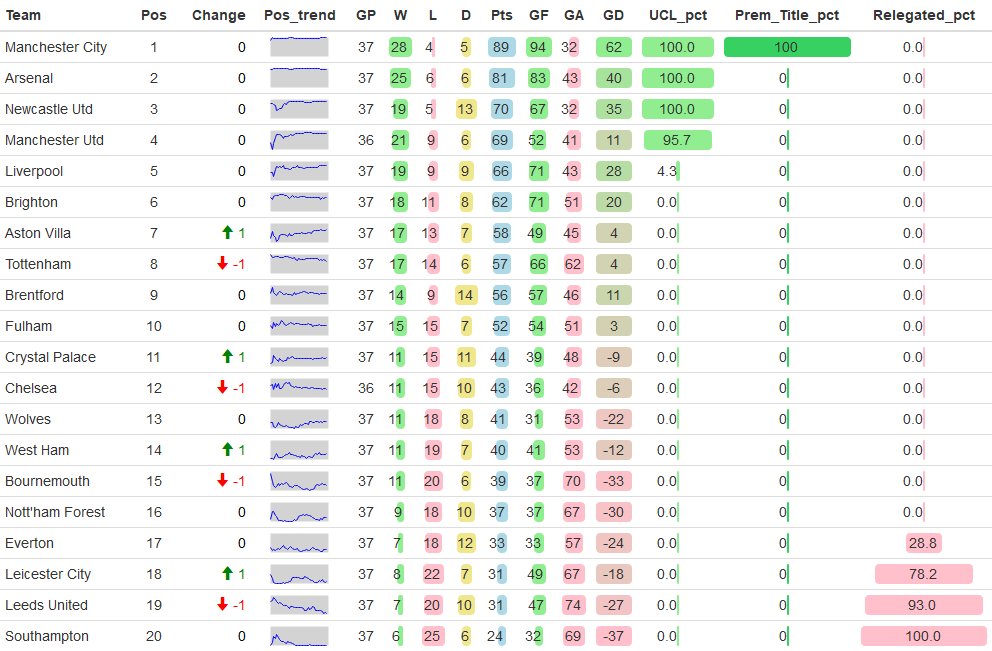
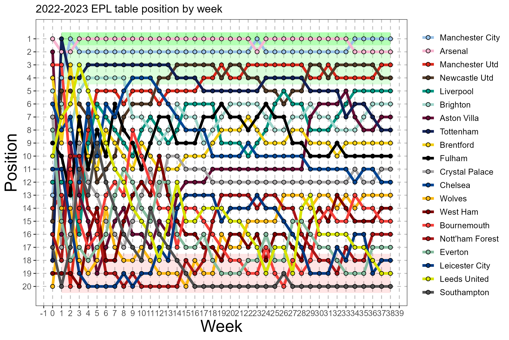
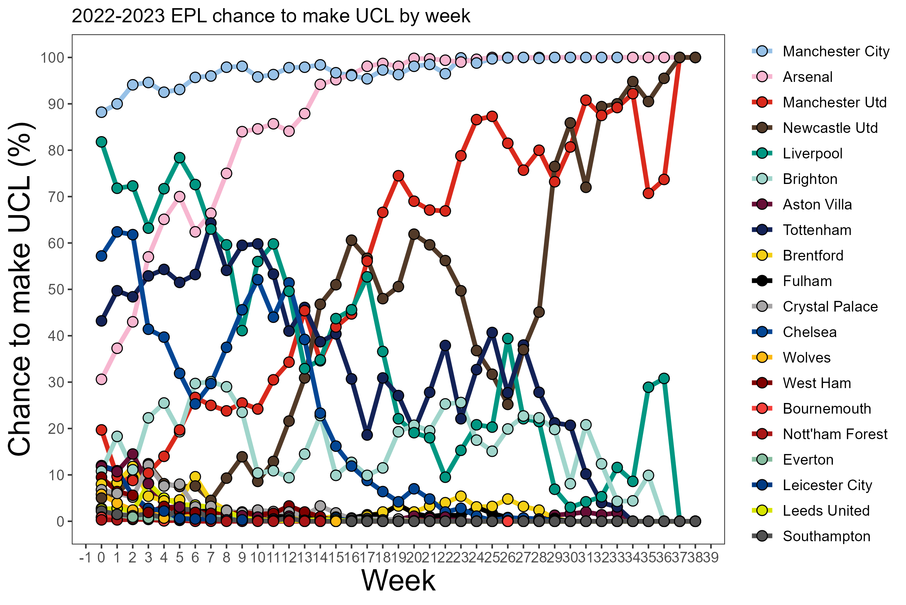
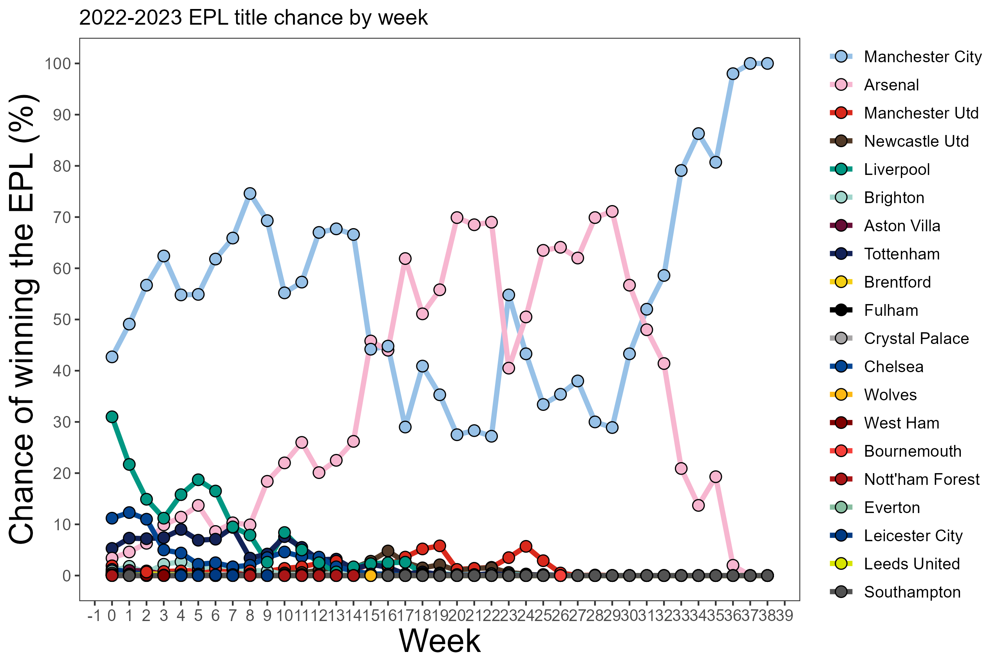
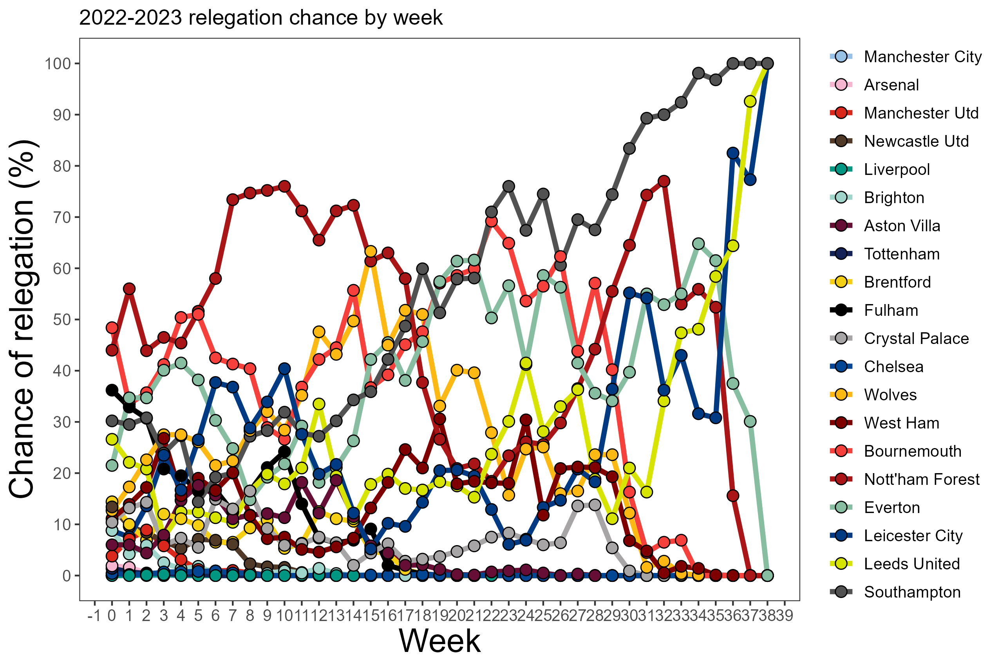
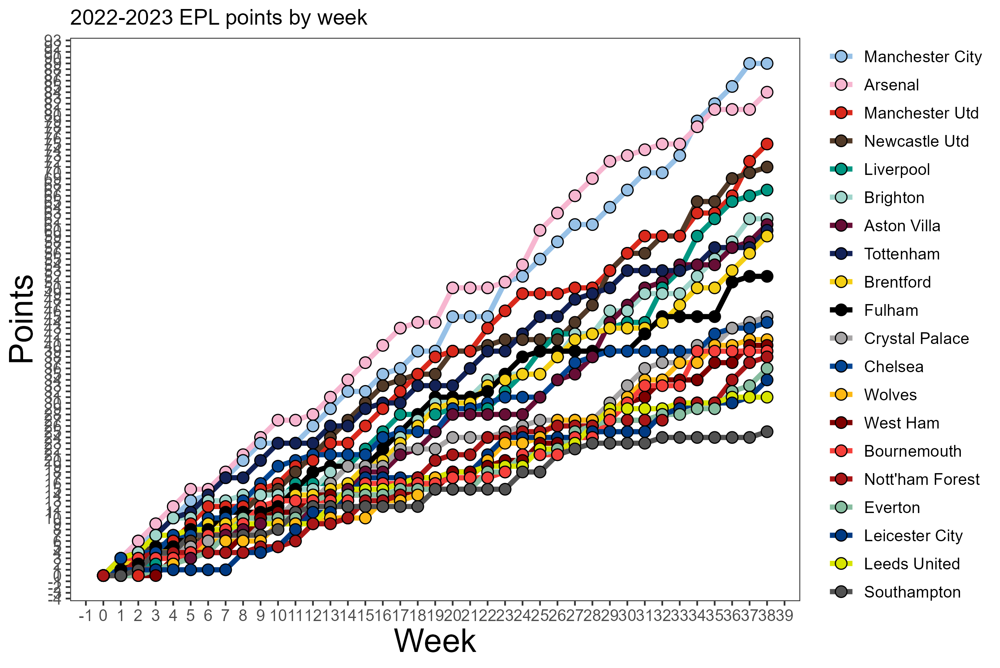
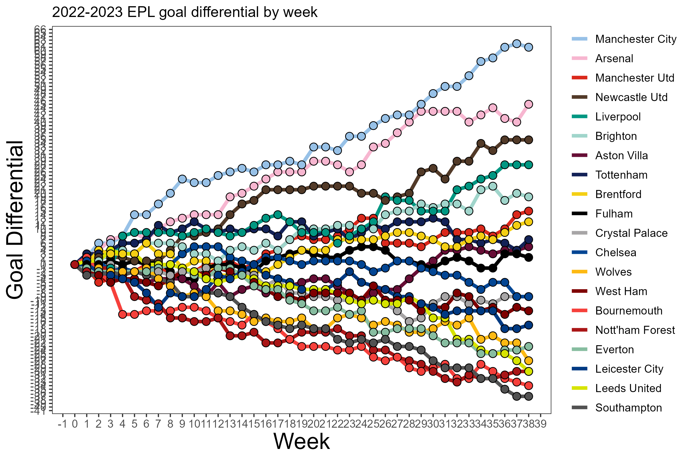
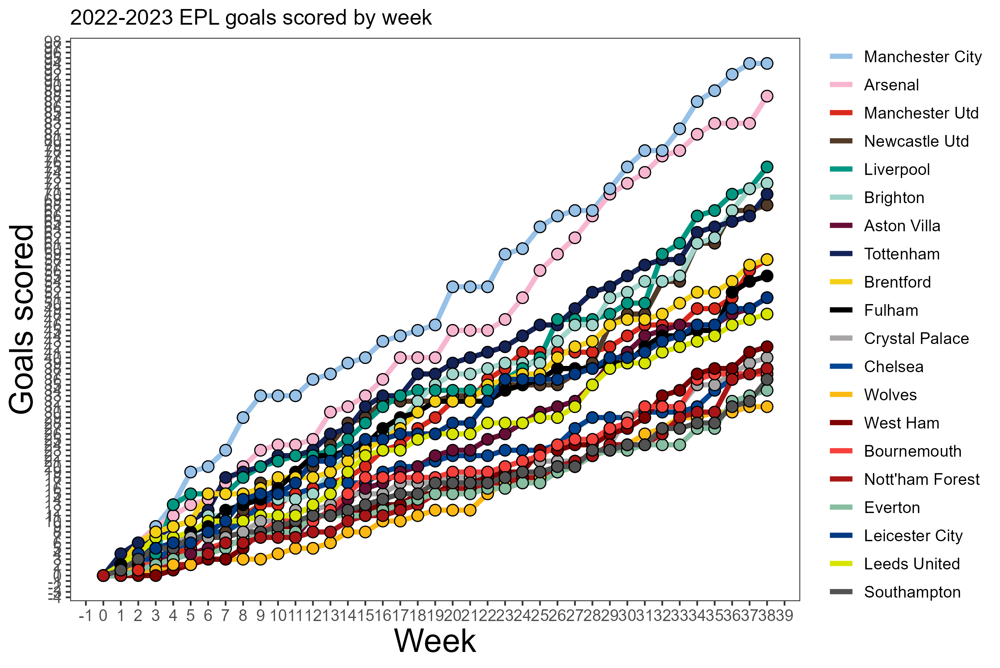
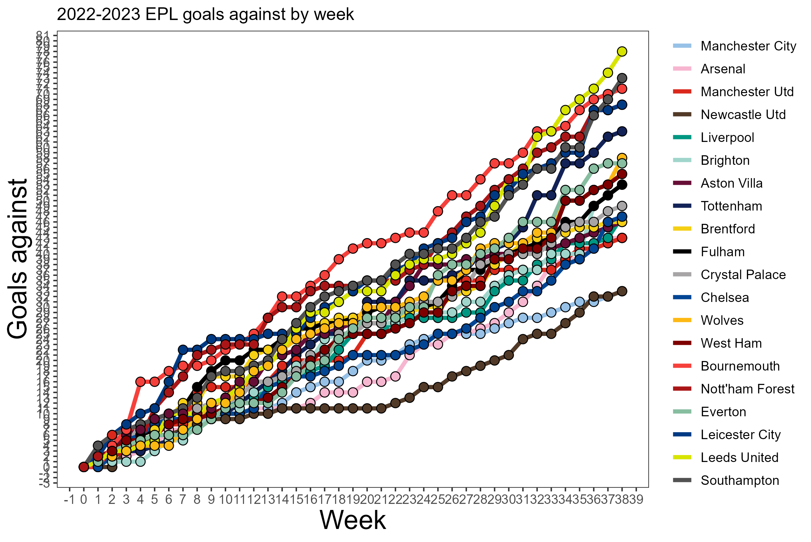
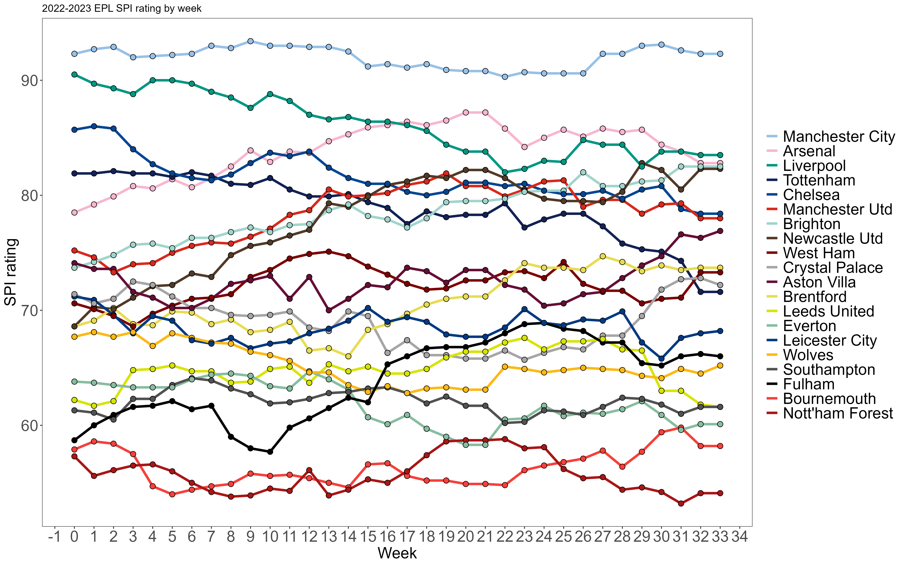

# Premier League 2022-23 Results and Visualization
by: Simon Weaver

## Source Code: 
[https://github.com/weaversd/EPL_2022_2023](https://github.com/weaversd/EPL_2022_2023)

## Table:

## Plots:

### Chance of UCL qualification (finishing in the top 4)

### Chance of winning the Premier league (finishing in position 1)

### Chance of being relegated (finishing in the bottom 3)

### Points per week

### Goal differential

### Goals scored

### Goals against

### SPI rating (from fivethirtyeight)

## Easiest way to run: 
* Ensure that all the files are in your working directory.
* Open "Run.R", highlight everything and run it.

## Sources  

SPI scores come from [fivethirtyeight](https://projects.fivethirtyeight.com/soccer-predictions/premier-league/)  

Scores and schedule come from [fbref](https://fbref.com/en/comps/9/11566/schedule/2022-2023-Premier-League-Scores-and-Fixtures)  

Prediction model is based on the method by [fivethirtyeight](https://fivethirtyeight.com/methodology/how-our-club-soccer-predictions-work/)

